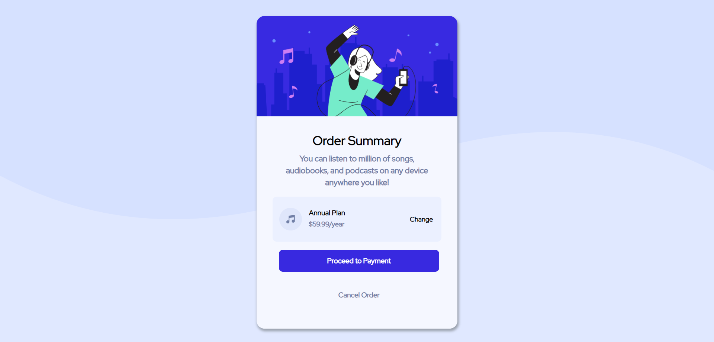

# Frontend Mentor - Order summary card

## Welcome! 👋

Thanks for checking out this front-end coding challenge.

This is a solution to the [Order summary card challenge on Frontend Mentor](https://www.frontendmentor.io/challenges/order-summary-component-QlPmajDUj). Frontend Mentor challenges help you improve your coding skills by building realistic projects.

### The challenge

The challenge is to build out this order summary card component and get it looking as close to the design as possible.

### Screenshot

<kbd></kbd>

### Link to project

Click -> [Order-summary-component](https://order-summary-component-frontend-mentor.netlify.app/)

### Built with

- HTML5
- CSS3
- CSS Flexbox

## Author

- Website - [Tharunprasath](https://tharunprasath.netlify.app/)

**Have fun building!** 🚀
